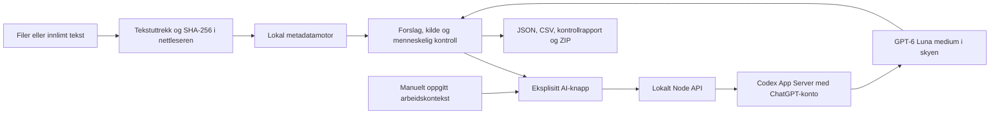

# Arkitektur

Den statiske klienten fungerer uten AI. `npm run local` bygger klienten og starter serveren på `127.0.0.1:5197`; `npm run preview` og den offentlige demoen serverer bare klienten. De har ingen kontotilkobling eller alternativ ekstern AI-backend.

## Moduler

- `index.html`, `styles.css`, `workspace.css`, `luna.css`: responsiv arbeidsflate med kilde ved siden av forslag og redigering, samt valgfritt AI-panel.
- `extract.mjs`: tekst-, MIME-, PDF-, Office- og OpenDocument-uttrekk; bevarer meningsfulle radgrenser og varsler om tegnsett-reserve.
- `engine.mjs`: første metadataforslag, datakvalitet, manifest og versjonert tittelpraksis. Innhold prioriteres før filnavn; manglende dokumentdato forblir tom.
- `app.mjs`: filbyte, SHA-256, tilstand, redigering, kontrollstatus og eksport. Bevarer menneskelige endringer når AI-svar kommer senere.
- `ai.mjs`: systemprompt, JSON-skjema, dataminimering og klient for det lokale API-et.
- `scripts/local-server.mjs`: begrenset statisk server, helse- og analyseendepunkter, validering og lokalt økttoken.
- `scripts/codex-bridge.mjs`: Codex-oppdagelse, stdio-protokoll, kontosjekk og isolert analysetråd.
- `zip.mjs`, `control-report.mjs`: originaler med sidecars og menneskelesbar kontrollrapport.
- `scripts/build.mjs`, `scripts/serve.mjs`: statisk bygg fra en eksplisitt filliste og forhåndsvisning uten AI.
- `tests/`: syntetiske format-, metadata-, bro- og nettlesertester med mockede modellresponser.

## Lokal API-grense

`GET /api/health` brukes først når AI-panelet åpnes. Det sjekker Codex, ChatGPT-autentisering, `gpt-6-luna`, `medium` og sikker konfigurasjon uten å starte en modellturn eller sende dokumenttekst. Det offentlige nettstedet kontakter ikke en besøkendes localhost.

`POST /api/archive-assist` krever en eksplisitt AI-handling, samme origin og serverens tilfeldige lokale økttoken. Serveren validerer nyttelast og svar og tillater én pågående analyse. Modellsvar følger et avgrenset JSON-skjema; avbrudd, timeout og kontraktbrudd gir feil uten alternativ modell eller API-fallback.

Nyttelasten omfatter maksimalt 12 000 tegn dokumenttekst, filnavn og et utvalg metadata. Manuell kontekst begrenses til `operatorName` 120, `department` 160 og `parentContext` 600 tegn. Ingen automatisk lesing av lokal brukeridentitet eller miljø inngår. `relation` kan foreslås ut fra dokumentet eller uttrykkelig oppgitt sak; verdien er tom uten belegg. Originalfiler omskrives eller lastes ikke opp som binærdata.

## Codex og kontoen

Broen bruker [Codex App Server](https://learn.chatgpt.com/docs/app-server) over stdio og godtar bare administrert ChatGPT-innlogging. Codex håndterer egne legitimasjonsopplysninger. Modellen kjører i skyen under kontoens tilgang og brukskvoter; det lokale API-et er ingen lokal språkmodell.

Hver operasjon får en midlertidig arbeidsmappe og en ephemeral-tråd. Prosessoverstyringer begrenser filtilgang til lesing av denne mappen, sperrer agentens nettverk og deaktiverer blant annet shell, koblinger, plugins og nettleserfunksjoner. Rettighetsprofilen tillater ikke filskriving selv om et skriveverktøy skulle være tilgjengelig. Broen kontrollerer faktisk konfigurasjon og trådinnstillinger før en analyse og avbryter ved uventede verktøy-/godkjenningsforespørsler. Global Codex-konfigurasjon endres ikke. Midlertidig mappe og underprosess ryddes etterpå. Skykommunikasjon for selve modellen er fortsatt nødvendig.

Dokumentet og brukeroppgitt kontekst er ubetrodd data, ikke instruksjoner. Kilden vises med `textContent`. Promptregler og tekniske grenser erstatter ikke arkivfaglig kontroll. Se [SECURITY.md](./SECURITY.md) for behandlingsgrenser og [README.md](./README.md) for kjøring og tester.
