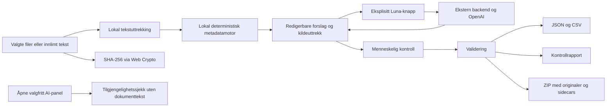

# Arkitektur

## Dataflyt

Første uttrekk og metadataforslag er lokale. Generativ forbedring bruker GPT-5.6 Luna med reasoning `medium` via en ekstern Cloudflare Worker; den bruker ikke en språkmodell i nettleseren. Oppstart og import kontakter ikke Luna. Å åpne AI-panelet sjekker tilgjengelighet uten å sende dokumentinnhold. En eksplisitt analyseknapp sender et avgrenset tekstutdrag, filnavn og utvalgte metadata.

## Arbeidsflyt

1. `app.mjs` tar imot filer eller lager en TXT-fil av innlimt tekst. Originalbyte beholdes til eventuell eksport.
2. `extract.mjs` henter lesbar tekst fra støttede formater. Den beholder relevante liste-, rad- og cellegrenser, leser MIME-deler og håndterer Windows-1252 som varslet reserve for ugyldig UTF-8.
3. `engine.mjs` lager første forslag fra uttrykkelige metadata, overskrifter eller meningsbærende tekst. Filnavn er tittelfallback. Dokumentdato hentes fra innhold før datert filnavn; manglende dato blir tom, ikke filstempel eller importdato.
4. Brukeren sammenligner forslag og kildeuttrekk, redigerer felter og godkjenner tittelen. Felles metadata og avanserte felt er tilgjengelige uten å dominere første visning.
5. Valgfri Luna-analyse håndteres av `ai.mjs`. `app.mjs` beskytter godkjente/menneskeredigerte titler og endringer gjort mens svaret var underveis.
6. Eksport inneholder metode, begrunnelse, sikkerhet, promptversjon og kontrollstatus. Originalfilene omskrives ikke; metadata leveres som manifest og sidecars.

## Ekstern AI-grense

- Tilgjengelighet: `GET /api/health` på `noark-luna-api.rolfsselas.workers.dev`, først ved åpning av valgfritt AI-panel.
- Analyse: `POST /api/archive-assist`, bare etter eksplisitt handling. Klienten sender maksimalt 12 000 tegn dokumenttekst, avgrenset filnavn, utvalgte metadata, forespørsels-ID og Turnstile-token.
- Tillatte metadata: tittel/tittelforslag, dokumenttype, emne, dokumentdato, ansvarlig/forfatter, organisasjonsenhet, språk og uttrekksmetode.
- Cloudflare Turnstile lastes ved analysehandlingen, ikke ved vanlig import eller tilgjengelighetssjekk.
- Originalfilens binærdata sendes ikke. Lokal analyse og eksport er uavhengig av om den eksterne tjenesten er tilgjengelig.
- Klienten kontrollerer modell-/reasoningkontrakten og parsesvaret. Backendens drift, logging og lagringsvilkår er utenfor den statiske klientens kontroll.

## Moduler

- `index.html`, `styles.css`, `workspace.css` og `luna.css`: semantisk og responsiv arbeidsflate med prøving, kontroll, eksport og valgfritt AI-panel.
- `extract.mjs`: lokal tekst-, e-post-, PDF-, Office Open XML- og OpenDocument-lesing.
- `engine.mjs`: metadataforslag, datakvalitet, filnavn, manifest og personopplysningssignaler.
- `ai.mjs`: klient for ekstern Luna-backend, Turnstile, versjonert prompt, dataminimering og strukturert svar.
- `app.mjs`: File API, Web Crypto, tilstand, menneskelig kontroll, brukerinitierte AI-kall og nedlasting.
- `zip.mjs`: ZIP-skriver med CRC-32 og UTF-8-filnavn.
- `control-report.mjs`: kontrollstatus og rapport i Markdown.
- `scripts/build.mjs`: statisk `dist/` fra en eksplisitt liste klientfiler.
- `scripts/serve.mjs`: lokal forhåndsvisning av bygget på `127.0.0.1`.
- `tests/`: Node-tester og ti syntetiske dokumenter med SHA-256 og kildebelagt fasit.
- `tests/browser/verify.mjs`: Playwright-kontroll med syntetiske data og mockede eksterne svar; ingen levende API-kall.

## Tillitsgrenser og begrensninger

Dokumenttekst er ubetrodd data. Kildeuttrekket settes med `textContent`, og AI-prompten instruerer modellen om å ignorere kommandoer i dokumentet. Dette erstatter ikke menneskelig kontroll av svaret.

Tittelforslag er ikke journalføring eller arkivfaglige vedtak. Sidecars er et overføringsformat, ikke uforanderlig arkivlagring. PDF-leseren utfører ikke OCR, uttrekk kan miste layout, og personopplysningssignaler kan gi både falske positive og falske negative. Tilgang og bevaring må besluttes etter virksomhetens regler.

## Bygg og kontroll

`npm ci`, `npm test`, `npm run build` og `npm run preview` installerer utviklingsverktøy, tester og viser den statiske klienten. `npm run test:browser` bruker Playwright Chromium eller nettleserbanen i `ARCHIVE_ASSIST_CHROME`. Testene blokkerer/erstatter eksterne tjenester og kan gjennomføres uten modellkostnader. Se [README.md](./README.md) for kommandoer.
